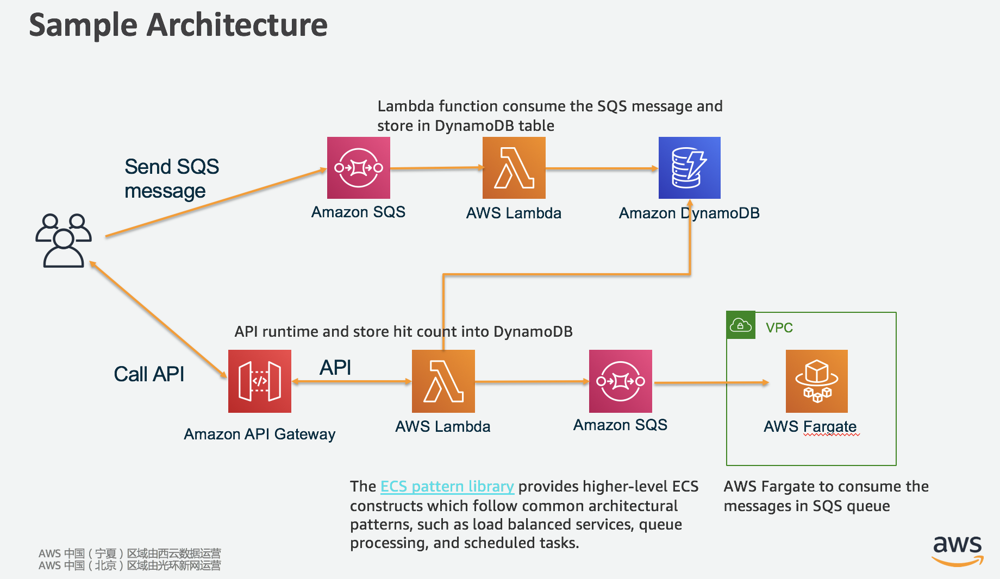
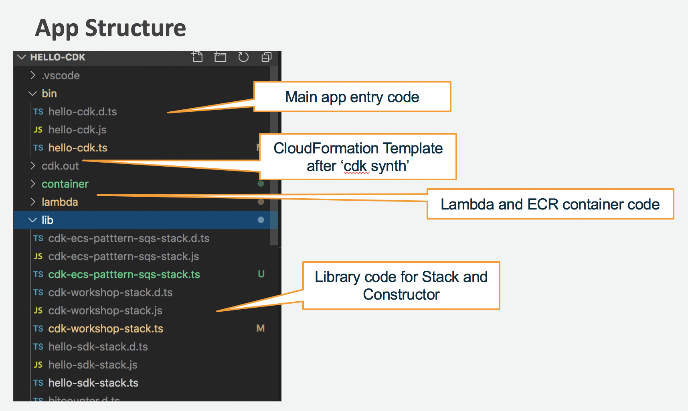

# Welcome to your CDK TypeScript project!

This is a quick start project for TypeScript development with CDK. More concept of AWS CDK you can refer: 
[aws-cdk-guide](https://docs.aws.amazon.com/cdk/latest/guide/home.html "aws-cdk-guide")
[cdkworkshop](https://cdkworkshop.com/ "cdkworkshop")

The `cdk.json` file tells the CDK Toolkit how to execute your app.

# First time run to bootstrap the CDK Toolkit in your environment
CDKToolkit CloudFormation Stack will be created and make sure it executed successfully.

```
cdk bootstrap
```

# Create project
```
cdk --app "npx hello-cdk test/hello-cdk.test.ts" ls
mkdir hello-sdk
cdk init --language typescript
cdk ls
```

# Build project
The architecture is quick start try to build
> Architecture for quick start.


> App Code Structure.


## useful commands
```
# check the compile error
npm run watch

# Compiling the App
npm run build

# Synthesizing an AWS CloudFormation Template
cdk synth

# deploy the project resources
cdk deploy --profile cn-north-1

# destroy the project resources
cdk destroy --profile cn-north-1

# multi stack
cdk deploy CdkWorkshopStack

```

# Add aws resource
## s3
```
npm install @aws-cdk/aws-s3

import s3 = require('@aws-cdk/aws-s3');

new s3.Bucket(this, 'BUCKET_NAME', {
    versioned: true
});
```

## sqs
```
npm install @aws-cdk/aws-sqs

import sqs = require('@aws-cdk/aws-sqs');

new sqs.Queue(this, "QUEUE_NAME", queueProps);
```


## lambda
```
npm install @aws-cdk/aws-lambda
npm install @aws-cdk/aws-lambda-event-sources

import lambda = require('@aws-cdk/aws-lambda');
import event_sources = require('@aws-cdk/aws-lambda-event-sources');

new lambda.Function(this, "HelloCDK-Function", {
            runtime: lambda.Runtime.NODEJS_10_X,
            code: lambda.Code.asset('lambda'),
            handler: 'index.handler'
        });
```

## dynamoDB
```
npm install @aws-cdk/aws-dynamodb

import dynamodb = require('@aws-cdk/aws-dynamodb');

new dynamodb.Table(this, 'HelloCDK-DDB-Table', {
            partitionKey: {name: 'id', type: dynamodb.AttributeType.STRING}
        });
```

## api gw
```
npm install @aws-cdk/aws-apigateway

import apigw = require('@aws-cdk/aws-apigateway');

new apigw.LambdaRestApi(this, 'CdkWorkshopAPI', {
        handler: HelloCounter.lambda_handler,
        endpointTypes: [apigw.EndpointType.REGIONAL]
    });
```

# Use 3rd party Construct Libraries 
## Demo aws-ecs-patterns to quick deploy ECS fargate cluster to consume SQS message by using Queue Processing Services
[aws-ecs-patterns](https://docs.aws.amazon.com/cdk/api/latest/docs/aws-ecs-patterns-readme.html "aws-ecs-patterns")

```
# Build your SQS Consumer
aws ecr create-repository --repository-name receive-sqs-message --region YOUR_REGION --profile YOUR_PROFILE
docker build -t <repositoryUrl> .
docker run -e AWS_ACCESS_KEY_ID=abc -e AWS_SECRET_ACCESS_KEY=xyz \
<repositoryUrl>:latest ARG1 ARG2
docker push <repositoryUrl>

npm install @aws-cdk/aws-ecs-patterns
import ecs_patterns = require('@aws-cdk/aws-ecs-patterns');
```

# Trouble shooting
## Compile error: Argument of type 'this' is not assignable to parameter of type 'Construct'
https://github.com/aws/aws-cdk/issues/542
Try to upgrade everything to latest version